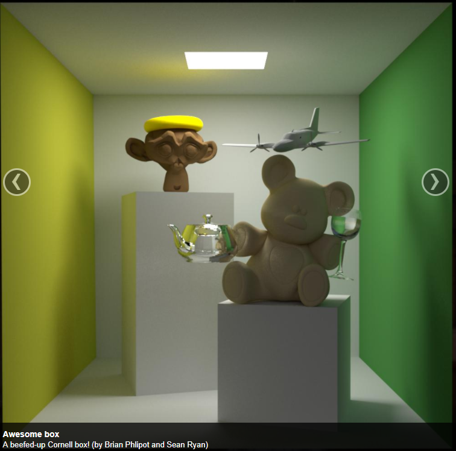
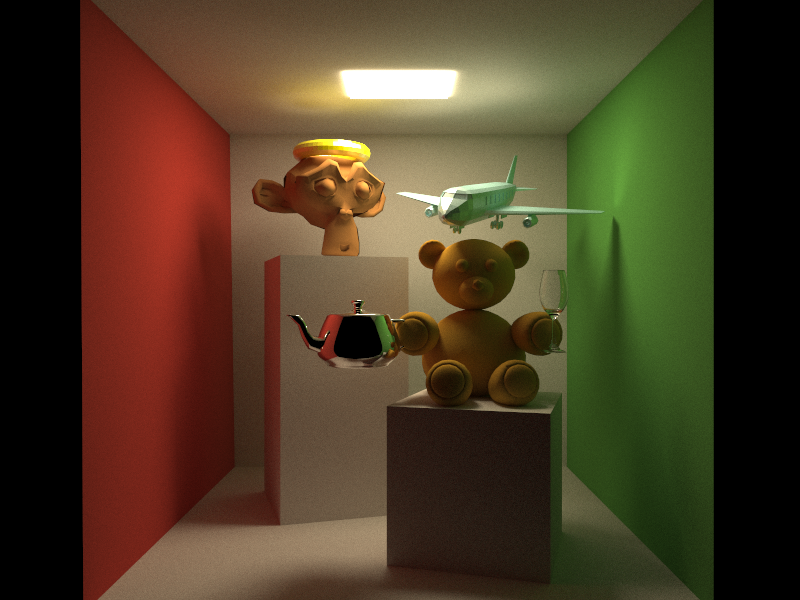

# Awesome-box model
> cornel-box based obj model

# Origin
This model is inspired from nori path tracer's gallery.  
[http://www.cs.cornell.edu/courses/cs6630/2012sp/nori/]

# About this
Note that this model is *slightly different* from the original one above. Especially for the toy bear & airplane submodel.

The following is a rendering result for this model by a simple Monte Carlo path tracer.

ALL submodels are obtained from the Internet.